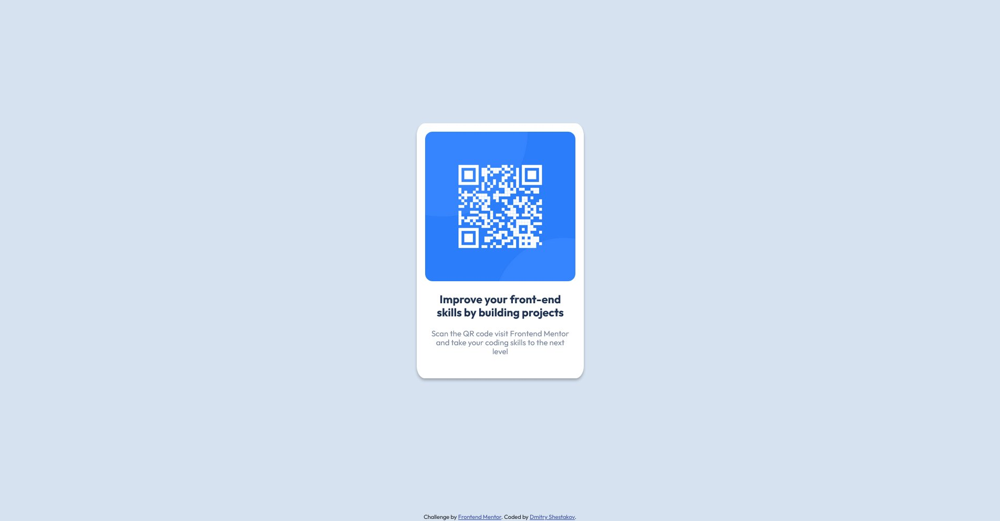

# Frontend Mentor - QR code component solution

This is a solution to the [QR code component challenge on Frontend Mentor](https://www.frontendmentor.io/challenges/qr-code-component-iux_sIO_H). Frontend Mentor challenges help you improve your coding skills by building realistic projects. 

## Table of contents

- [Overview](#overview)
  - [Screenshot](#screenshot)
  - [Links](#links)
- [My process](#my-process)
  - [Built with](#built-with)
  - [What I learned](#what-i-learned)
  - [Continued development](#continued-development)
  - [Useful resources](#useful-resources)
- [Author](#author)
- [Acknowledgments](#acknowledgments)

**Note: Delete this note and update the table of contents based on what sections you keep.**

## Overview

### Screenshot

### Links

- Solution URL: [Add solution URL here](https://your-solution-url.com)
- Live Site URL: [Add live site URL here](https://your-live-site-url.com)

## My process

### Built with

- SCSS
- Bootstrap css framework

### What I learned

I learned how to position the block in the center with the position property :)

### Continued development

I want to redo the layout using grids or flexboxes in the future

### Useful resources

- [Example resource 1](https://getbootstrap.com/docs/5.2/getting-started/introduction/) - This helped me to make up the page.
- [Example resource 2](https://developer.mozilla.org/en-US/docs/Web/CSS/padding) - I forgot how to use padding in one line :)

## Author

- Website -  in progress
- Frontend Mentor - [@siberiashaman](https://www.frontendmentor.io/profile/siberiashaman)

